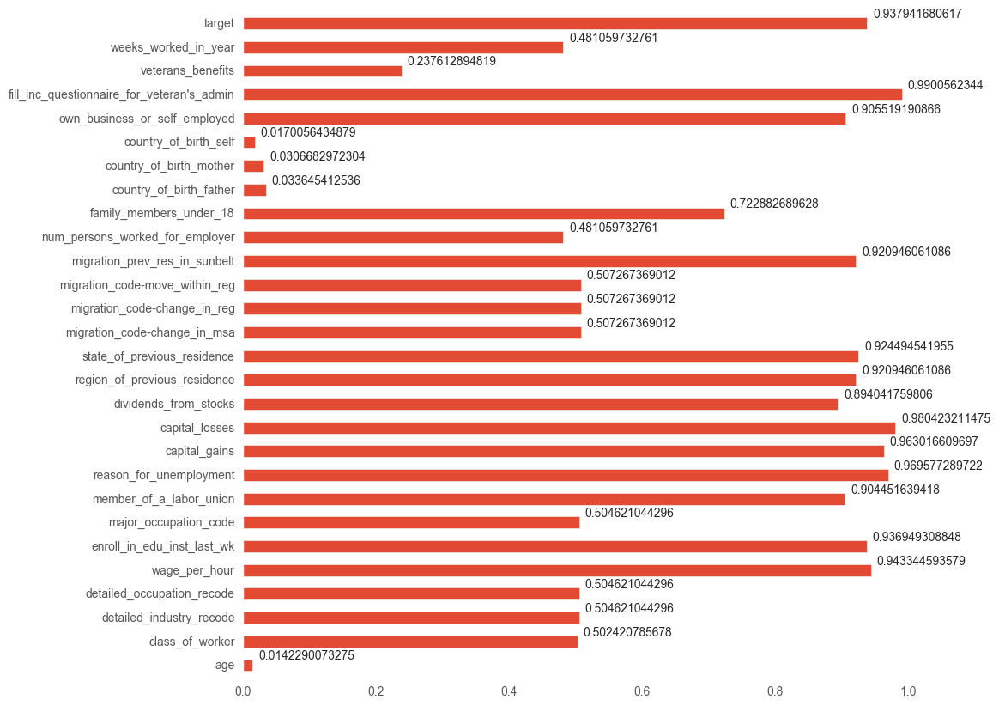
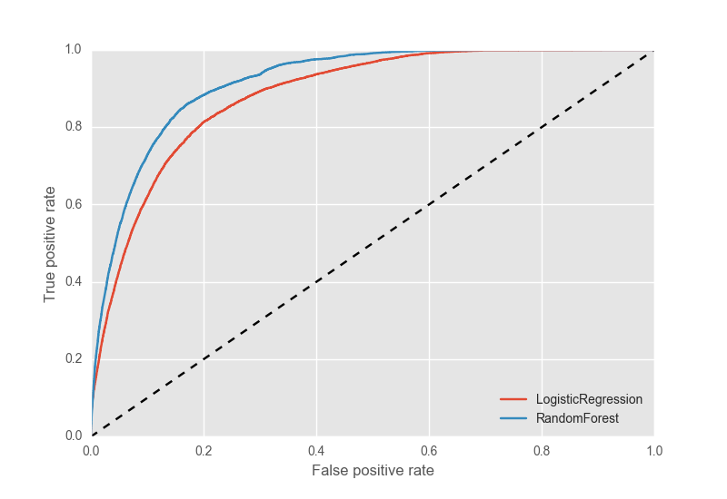

## Dataiku Data Challenge: Predicting earnings
_Ben Batorsky_

### Introduction

This document outlines the construction of a model to predict probability of earning at least 50,000 in a year using 1994 and 1995 census data from 200,000 individuals.  The census data includes information on demographics, employment and financial status.  The model trained on these 200,000 individuals was then tested on a set of X individuals in order to measure the prediction accuracy

### Methods

The distributions of training data features were analyzed based on visual inspection.  Features were of different types, with some continuous (e.g. age), some categorical (e.g. race) and some binary (e.g. Hispanic/non-hispanic).

Based on visual inspection, it became clear that many of the values for some of the features were either null or zero.  For example, capital losses and gains were zero for over 95% of individuals.  If a feature had over 80% missing or zero variables, they were considered for exclusion as they would likely not contribute greatly to predicting earnings.

The distribution of the earnings variable was tested at the different levels of these features in order to check whether there were significant differences between the zero/null group and the non-zero/non-null group.  Levene&#39;s test1 was used.  Levene&#39;s test is less sensitive to normality assumptions than either Barlett&#39;s or an F-test.

Extreme values of continuous variables were also inspected (i.e. those more than 2 standard deviations from the mean).  If a small portion of individuals showed extreme values on any variable, they would be dropped from the sample.

The predictive models that were tested were Random Forest and Logistic Regression.  Random Forest was chosen because the multi-dimensionality of the data may be addressed by the bootstrap subsampling of individuals and features.  Logistic Regression is a reasonable comparison with the ensemble method, though required scaling of variables.

Both models were implemented with allowances for imbalance in the target variable.  Model hyperparameters were tuned using randomized gridsearch with 3-fold cross-validation in order to find parameters that maximized the area under the ROC curve.

### Results

Due to insignificant differences in the distribution of the earnings variable, the features wage per hour, reason for unemployment and veteran&#39;s income questionnaire were dropped from the data.  Also, 2% of the individuals from the training data were dropped due to extreme values for capital gains/losses or earnings from stocks were dropped from the training set.  These individuals likely represented a small portion of the population and would not be useful for prediction.

_Figure 1: % zero/null by 

The results of the randomized gridsearch indicated that the performance of Logistic Regression and Random Forest were not much different (AUC  of .92 and .91, respectively).  L1-regularization was chosen for Logistic Regression and trees for the Random Forest model were fit on 20% subsamples of the features (i.e. 26 features).

Despite this minor difference in performance on the validation set, Random Forest actually appeared to outperform Logistic Regression on the test set.  This is likely due to the Logistic Regression overfitting on too many features (i.e. 130 features).

_Figure 2: ROC curve for predictive models

### Discussion

Though the Random Forest appeared to be the most predictive model on a hold-out set, it may be advisable to construct additional features for the Logistic Regression in order to improve performance.  With large samples like the ones in the census data, Logistic Regression may be more scalable.

From Levene&#39;s test, it appears that features related to filer status and gender had major variations in the numbers of people who earned $50,000 at different levels.  Gender variation seems reasonable, considering there is substantial research indicating gender is related to earnings.  Status as a &quot;non-filer&quot; appears to be related to earnings, which may suggest incompleteness in data.  If someone is a non-filer, their characteristics may be incorrectly or incompletely reported in the data.  Additional analysis would be warranted before using the model in production, as those without accurate or with out-of-date information should be treated differently from complete-cases.

#

1 Levene, H. (1960). In _Contributions to Probability and Statistics: Essays in Honor of Harold Hotelling_, I. Olkin et al. eds., Stanford University Press, pp. 278-292.